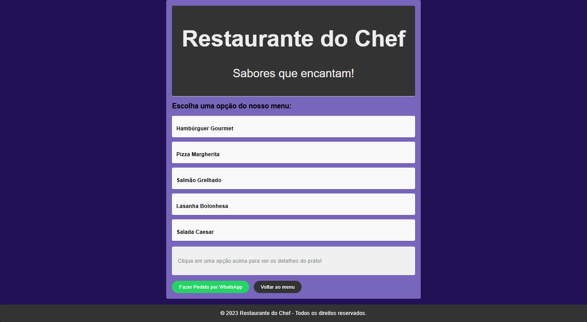

# Cardápio Online - Restaurante do Chef

Cardápio digital simples e interativo para restaurantes com sistema de pedidos via WhatsApp.

## Sobre
Aplicação web que permite aos usuários visualizarem itens do cardápio, adicionarem produtos a um carrinho virtual e finalizarem o pedido enviando os dados diretamente para o WhatsApp do estabelecimento. Projeto focado na manipulação do DOM, gerenciamento de carrinho e integração com a API do WhatsApp.

### Imagens do projeto:

### Demo
Acesse a demo ao vivo aqui: [Link para Demo](https://restaurantedochef.vercel.app)

## Tecnologias
- HTML5
- CSS3 
- JavaScript

## Como Usar
Opção 1 — Abrir diretamente
- Baixe/clones este repositório.
- Abra o arquivo index.html no navegador.

Opção 2 — VS Code (Live Server)
- Instale a extensão Live Server
- Clique em  Go Live dentro do index.html

## Estrutura
- index.html: marcação e estrutura do cardápio/modal
- styles.css: estilos e layout responsivo
- script.js: lógica do carrinho e integração com WhatsApp

## Scripts
Este projeto não possui package.json nem scripts de npm/yarn; é um app estático e pode ser executado diretamente no navegador.

## Autor
- Nome: João Vitor - Web Dev
- GitHub: https://github.com/joaovitor-webdev
- Portfólio: https://joaovitor-webdev.vercel.app
